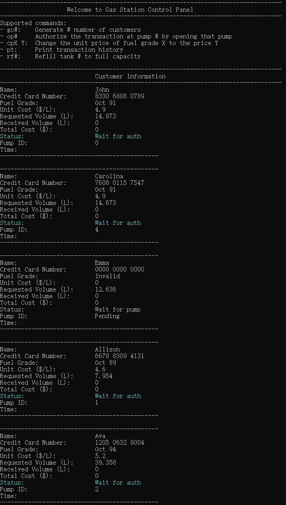
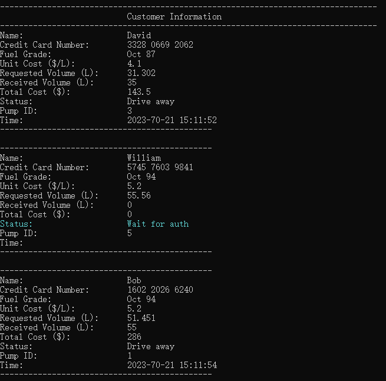
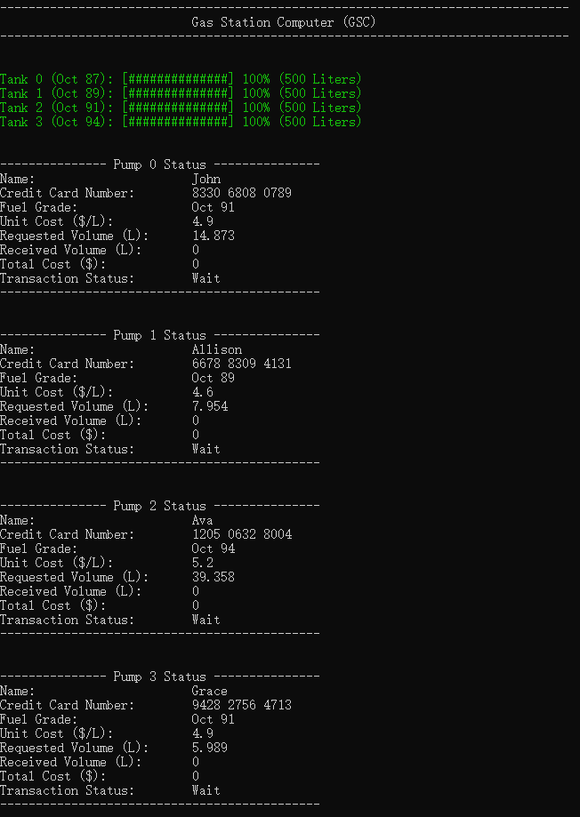
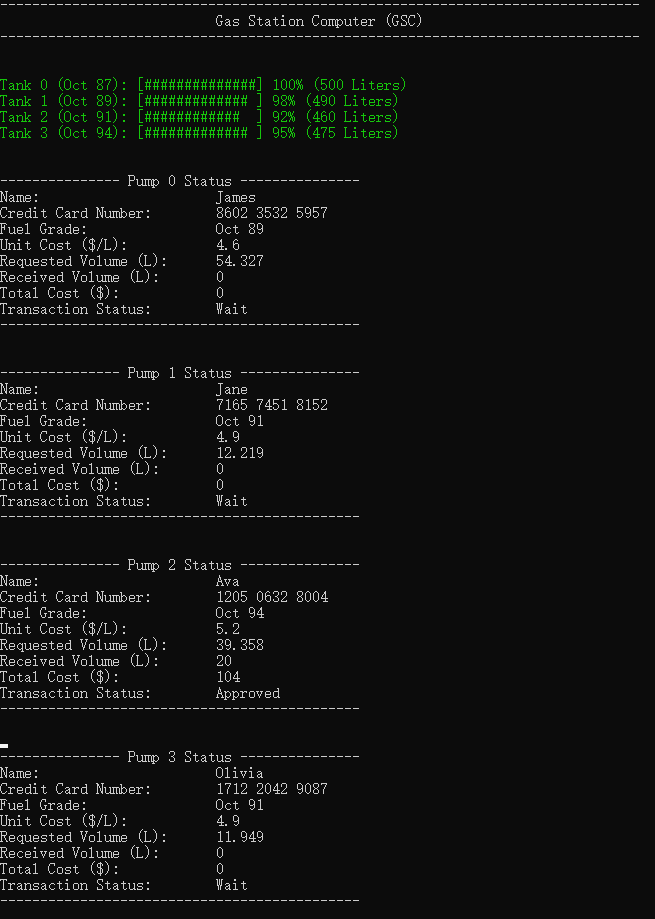

# README
My implementation of the Gas Station Simulation Model meets all the required design specifications with some extra features for bonus points.

## User Interface of the Attendant’s Computer

## User Interface of the Gas Station Display

## Extra Features
My Gas Station Simulation Model includes the following extra features:
* To simulate a desired number of customers, use the `CP#` command. For instance, to generate 10 customers, select the attendant computer window "Computer.exe" and enter `CP10` followed by the Enter key.
* You can simulate any number of pumps by manually modifying the global constant variable `NUM_PUMPS` in the `common.h` file and then rebuilding the solution. By default, the gas station simulation model includes six pumps.
* The gas station display shows real-time status updates for all customers, including those waiting for an available pump and those pending authorization from the attendant for their transactions.
* The text color of the remaining fuel readings in the tanks varies based on the volume of fuel remaining in each tank.